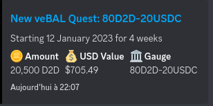

# Discord-Quest-Bot

Discord bot that send a message to a specific channel whenever there is a new quest being created for **Curve** or **Balancer**

<div align="center">
  
</div>

## Dependencies & Installation

To start, make sure you have `node` & `yarn` installed : 
* `node` - tested with v16.16.0
* `yarn` - tested with v1.22.19

Then, clone this repo, and install the dependencies : 

```
git clone https://github.com/PaladinFinance/Discord-Quest-Bot.git
cd Discord-Quest-Bot
yarn
```

This will install all the depdencies needed for the project such as `discordjs`, `etherjs` ...

You will need a discord bot so I suggest you create one following a tutorial like this [one](https://www.xda-developers.com/how-to-create-discord-bot/) and don't forget to invite to your server with tha ability to at least read and write messages into text channels

## Start

- First you need to set environment variables in the .env
- Then you can set the contract addresses for the two QuestBoard as veCRVQuestBoardContractAddress and veBALQuestBoardContractAddress inside the [data file](./src/data/data.json)
- Finally you can start the discord bot with `yarn start`

## Utilisation

The bot so far has two commands:
    - !here
    - !target CHANNEL_NAME
The `!here` set the interaction channel to the one where you send the message so the channel where you can talk with the bot (only the Paladin role can call it)
The `!target CHANNEL_NAME` set the target channel so where are going to be the messages whenever there is a new quest (everyone can call it on the interaction channel)

## License 

This project is licensed under the MIT license